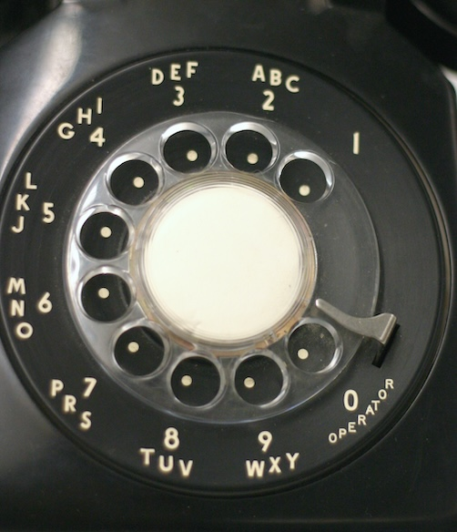

# Lab 23: Phone Words

The traditional North American rotary telephone dial, shown in the picture below, had letters associated with each digit. The lettering was originally used for dialing named exchanges, but it was kept because it facilitated memorization of phone numbers.

The practice continues today in modern telephone and smartphone keypads, which have the following associations:

* 0: none
* 1: none
* 2: ABC
* 3: DEF
* 4: GHI
* 5: JKL
* 6: MNO
* 7: PQRS
* 8: TUV
* 9: WXYZ

For example, the number 234 could form the words ADG, ADH, ADI, AEG, AEH, and so on.

What words can be made from your phone number? In this lab, we will write an algorithm to find out.

## findPhoneWords

Your task is to write a recursive algorithm that generates all possible combinations of a phone number. The algorithm is similar to the multiply-recursive _PuzzleSolve_ algorithm described in Section 3.5 of the textbook. The idea is to generate all possible combinations recursively until no more combinations can be made.

A recursive framework is provided for you in `phone_number.cpp`. The main "driver" function `findPhoneWords` takes a vector of `int` representing the number and outputs all word combinations of that number in the `words` vector. It then kicks off the recursion to an overloaded helper function of the same name, starting with an empty string as the current word and 0 as the current digit index.

The recursive function should work as follows:

* Base case: If `digitIndex` has reached the end of the input, then a letter combination (word) has been found. Add it to the `words` vector and do not recurse.
* Recursion: For each letter associated with the current digit, call `findPhoneWords` such that `word` is the letter appended to the current word, and `digitIndex` is `digitIndex` plus one. The `number` and `words` can simply be passed through.

You can assume that the number does not contain the digits 0 or 1 since they have no letter associations.
